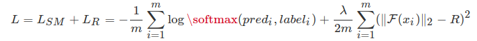
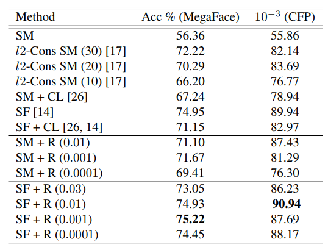

# Ring Loss
This is a Gluon implementation of the ring loss in the paper [1803.00130](https://arxiv.org/abs/1803.00130).

**Ring loss Definition**:



**MegaFace Result:**




## Requirement
python3.5+, mxnet-1.2.1+, matplotlib, numpy, seaborn, nvidia-dali, ...

## Mnist Example

Here is the visualization of minst with softmax and sotfmax+ringloss:

|Results|Train|Val |
|:---:  |:---:|:---:|
|Softmax|||
|Softmax+Ringloss|||


The training steps is:
1. use only softmax to train 10 epochs, and the val_acc is around 0.97.
2. finetune the pretrained net, hyper parameters is set as below:
```python
epochs = 100

lr = 0.01
lamda = 0.1

lr_steps = [40, 70, np.inf]
wd = 5e-4
momentum = 0.9
batch_size = 256

plot_period = 5
```

or just train from scratch:

```python
epochs = 100

lr = 0.1
lamda = 0.1

lr_steps = [40, 70, np.inf]
wd = 5e-4
momentum = 0.9
batch_size = 256

plot_period = 5
```

Try to change parameter `lamda` to get different train result of mnist. 

## Face Recognition Training
As I don't have enough time and GPUs to train a sota model, model provided 
in this repo only get `0.985333+-0.006489` on LFW, see `models/mobile_facenet/model-0000.params`.

For training a face model, we need do lots of work:
- data, [emore](https://github.com/deepinsight/insightface/issues/215) as training set and lfw as val set, 
thx for deep insight's great work
- eval code from David Facenet Project
- network of mobile_facenet, it has only 1081250 params and 4.4MB size on disk
- data provider, Gluon or Nvidia-DALI, DALI allow fewer cpu cores for preprocess

It is important to use a larger R for init, like 20.0, use 1.0 usually cause loss NAN at beginning.

The first thousands of training step log:
```
[0.01, 10.0, [60000.0, 120000.0, 180000.0, inf], 0.1, 0.9, 4e-05, 512]

[epoch  0] [it  500] train loss: 10.639217, train_acc: 0.017017 | time: 189.237092
Radius 13.730684280395508
lfw: 0.859833+-0.016046


[epoch  0] [it  1000] train loss: 8.139757, train_acc: 0.087480 | time: 165.611764
Radius 17.39546012878418
lfw: 0.904833+-0.008738
 

[epoch  0] [it  1500] train loss: 6.160117, train_acc: 0.222719 | time: 165.051831
Radius 22.886869430541992
lfw: 0.927500+-0.011673
 

[epoch  0] [it  2000] train loss: 4.581241, train_acc: 0.372125 | time: 164.711719
Radius 27.97855567932129
lfw: 0.947833+-0.012911
 

[epoch  0] [it  2500] train loss: 3.506722, train_acc: 0.490793 | time: 165.024251
Radius 31.83747100830078
lfw: 0.951000+-0.012763
```
  
## References
1. Ring loss: Convex Feature Normalization for Face Recognition [1803.00130](https://arxiv.org/abs/1803.00130).
2. Insight Face https://github.com/deepinsight/insightface
3. Nvidia DALI [NVIDIA DALI documentation](https://docs.nvidia.com/deeplearning/sdk/dali-developer-guide/docs/index.html)