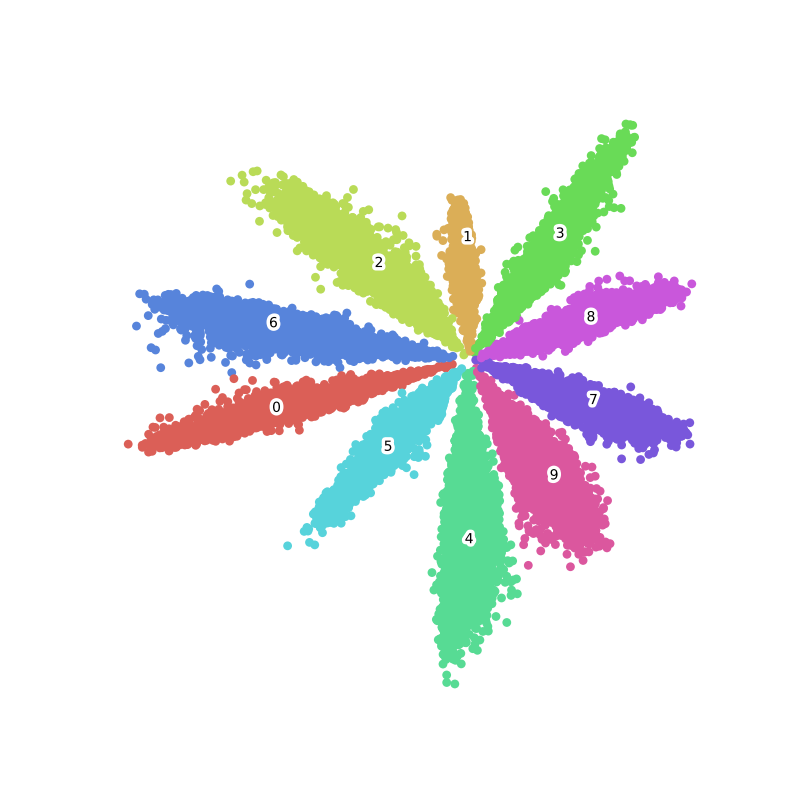
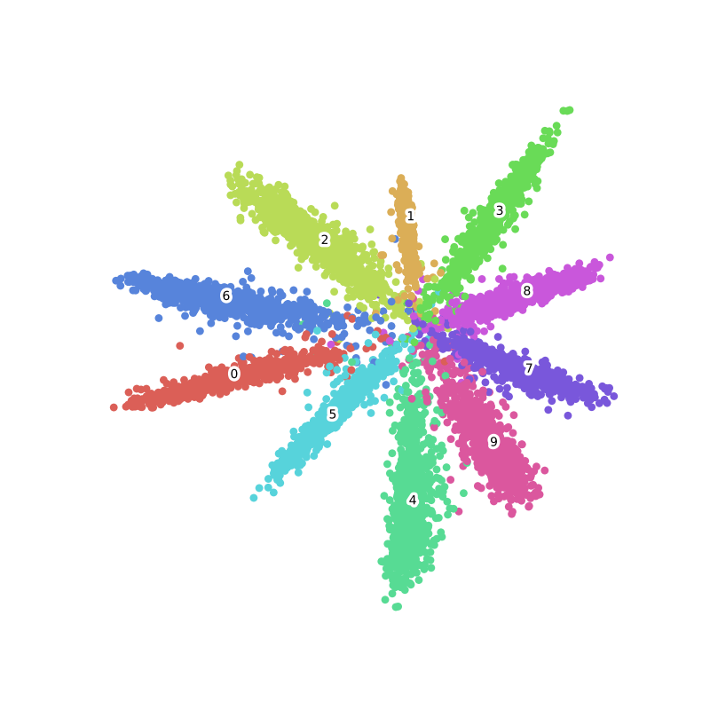
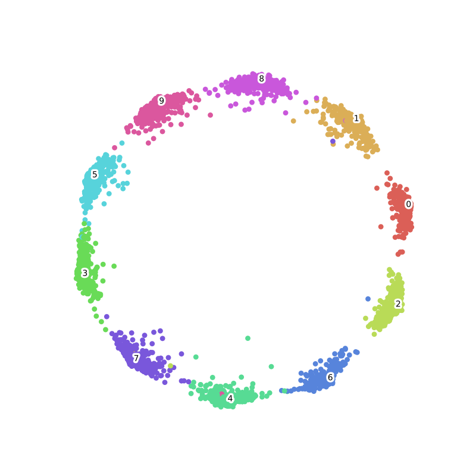
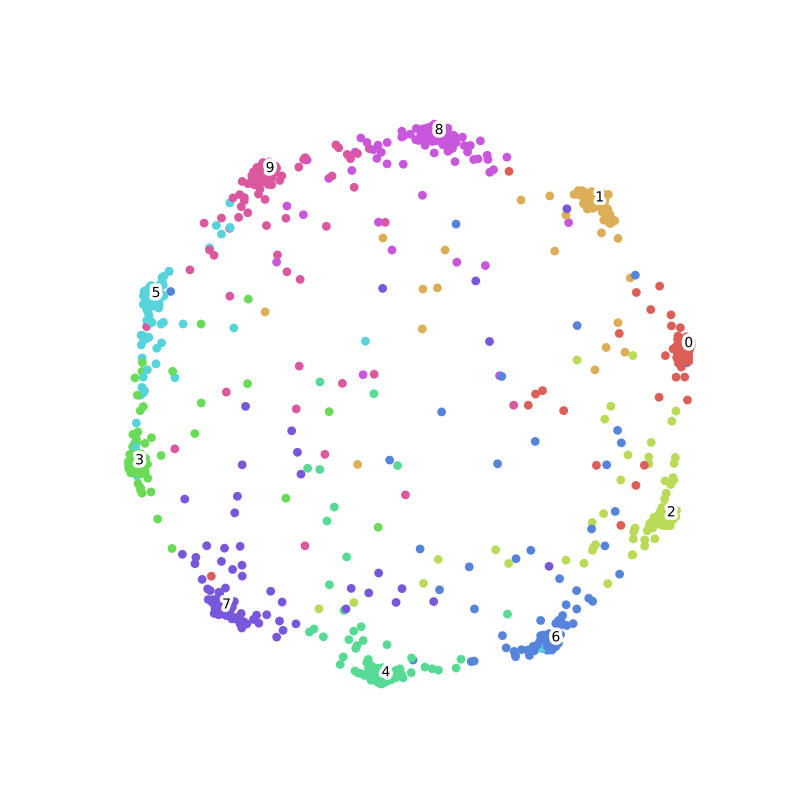

# Ring Loss
This is a Gluon implementation of the ring loss in the paper [1803.00130](https://arxiv.org/abs/1803.00130).

**Ring loss Definition**:

```math
 L = L_{SM} + L_R = - \frac{1}{m} \sum_{i=1}^{m} \log \softmax({pred_{i},{label}_i}) + \frac{\lambda}{2m} \sum_{i=1}^{m} (\Vert \mathcal{F}({x}_i)\Vert_2 - R )^2
```

## Requirement
python3.5+, mxnet-1.2.1+, matplotlib, numpy, seaborn, ...

## Mnist Example
Before training ring loss, a pretrained model is needed, 
it is hard to get the expected result when training ring loss from scratch. In fact, 
I never achieve the paper's result for mnist in my experiments.

Here is the visualization of minst with softmax and sotfmax+ringloss:

|Results|Train|Val |
|:---:  |:---:|:---:|
|Softmax|||
|Softmax+Ringloss|||


The training steps is:
1. use only softmax to train 10 epochs, and the val_acc is around 0.97.
2. finetune the pretrained net, hyper parameters is set as below:
```python
epochs = 100

lr = 0.01
lamda = 0.01

lr_steps = [40, 70, np.inf]
wd = 5e-4
momentum = 0.9
batch_size = 256

plot_period = 5
```

## References
1. Ring loss: Convex Feature Normalization for Face Recognition [1803.00130](https://arxiv.org/abs/1803.00130).